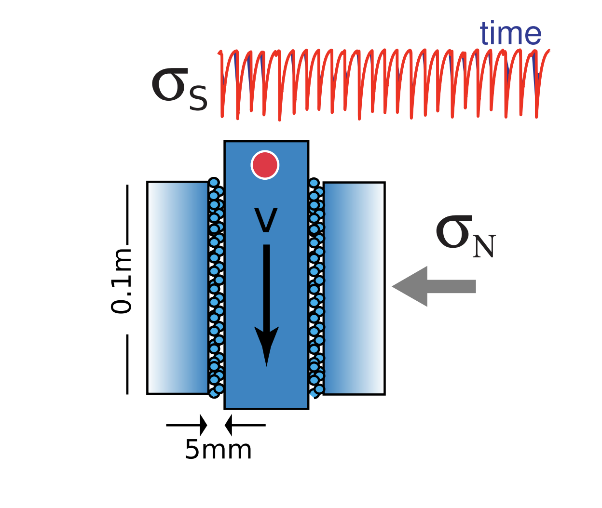
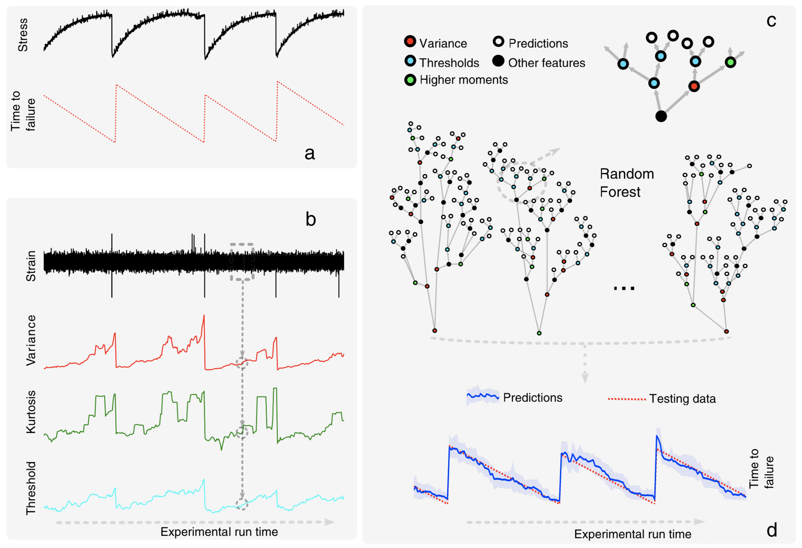
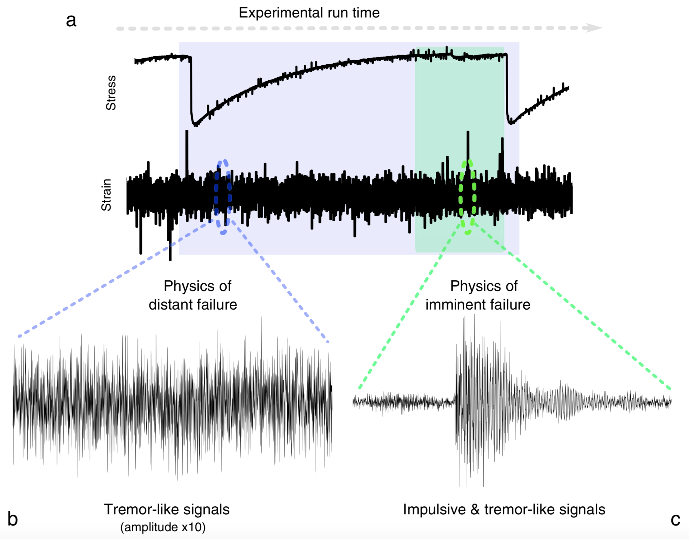

## Notes From “Machine Learning Predicts Laboratory Earthquakes”

*The following are notes I took from the paper mentioned by the organizers of LANL-Earthquake-Prediction competition. I think that these notes might be useful in the competition.*

The goal is identifying hidden signals that precede earthquakes by listening to the acoustic signal emitted by a laboratory fault. We use ML to identify telltale(revealing) sounds—much like a squeaky door—that predict when a quake will occur.

Acoustic/seismic precursors to failure appear to be a nearly universal phenomenon in materials. For instance, it is well established that failure in granular materials is frequently accompanied by **impulsive** acoustic/seismic precursors, many of them very small. Precursors are observed in laboratory faults and are widely but not systematically observed preceding earthquakes. We posit that seismic precursor magnitudes can be very small and thus frequently go unrecorded or unidentified.

Laboratory system:

<blockquote>

Laboratory system</blockquote>

The driving piston displaces at a very constant velocity of 5 μm/s during the inter-event time and accelerates briefly during slip. An accelerometer records the acoustic emission (AE) emanating from the shearing layers. The rate of impulsive precursors **accelerates** as failure approaches.

Our goal is to predict the time remaining before the next failure (Figure 1a, bottom) using only local, **moving time windows** of the AE data based on statistical features derived from the time windows.

<blockquote>

Figure 1 of the paper: part b shows acoustic emission (dynamic strain) data. The dashed rectangle represents a moving time window; each window generates a single point on each feature curve below</blockquote>

From each time window, we compute a set of approximately 100 potentially relevant statistical features (e.g., mean, variance, kurtosis, and autocorrelation). The most useful features are then selected recursively. The Random Forest (RF) uses these selected features to predict the time remaining before the next failure.

Each prediction uses only the information within one single time window of the acoustic signal. Thus, by listening to the acoustic signal currently emitted by the system, we predict the time remaining before it fails—**a “now” prediction based on the instantaneous physical characteristics of the system that does not make use of its history**. 

We find that statistics quantifying the **signal amplitude** distribution (e.g., its variance and higher-order moments) are highly effective at forecasting failure. The variance, which characterizes overall signal amplitude fluctuation, is the strongest single feature early in time. As the system nears failure, other outlier statistics such as the kurtosis and thresholds become predictive as well.

Figure (3b) shows a raw time series far from failure. The signal exhibits small modulations that are challenging to identify by eye and persist throughout the stress cycle. These modulations **increase in amplitude** as failure is approached, as measured by the increase in signal variance.

<blockquote>

Figure 3 of the paper</blockquote>

Our ML-driven analysis suggests that the system emits a small but progressively increasing amount of **energy** throughout the stress cycle, before abruptly releasing the accumulated energy when a slip event takes place.
 
The fact that timing prediction can be made under conditions the RF has never seen suggests that the time series signal is capturing fundamental physics that leads to the prediction.

### Notes from the supporting-information paper
We build our dataset by computing statistical features from local time windows of the acoustic emission signal. Each data point (i.e. local set of statistical features) is associated with a time to failure, which we calculate from the shear stress signal.

Note the predictions never reach zero due to the discretization in time of the problem imposed by the moving window approach. In particular, we **do not consider the time windows during which a failure occurred** because they would bias the prediction: at the moment failure takes place, all the statistical features are several orders of magnitude higher than the rest of the time. Moreover, we only care here about what happens leading up to failure, not at failure itself. This problem vanishes with **smaller windows**, at the cost of increased computation.

#### Model parameters
For this work, we used the scikit-learn implementation of the random forests. We compute regularization hyper-parameters by grid search based on a 3-fold cross-validation. The minimum number of samples to generate a split was 30. The minimum number of samples on a leaf was 30. The maximum number of features to consider when making a split was 40 (out of 100 features). The forest size was 1000 trees. The performance of the random forest is not sensitive to this choice of hyper-parameters: changing any hyper117 parameter by a factor of 2 typically affects the R2 performance by only a few percent. 

#### Moving window specs
To create a model that uncovers the physics of shear failure, we make predictions using moving time windows applied to the data. Each window is 1.8s, which is small compared to the time between fault gouge failures (8s on average). The offset between windows is 0.18s, meaning that **consecutive time windows overlap by 90 percent**. We characterize the acoustical signal in each window by a set of ≈ 50 statistical features. Each window is further **split** in two, and the features are computed for each sub-window to form one data point xi, totaling ≈ 100 statistical features. We then label the data point xi according to the time remaining until the next gouge failure, yi, determined from the stress signal.

#### Statistical features
We compute many statistical features within each time window for use by the random forest. The features can be separated into three main categories:

- Signal distribution and energy: we use several higher order moments of the acoustic data to capture the evolution of the signal’s energy. Within each time window we compute the signal’s mean and higher moments, normalized (variance, skewness, kurtosis), and not normalized (7 features)
- Precursors: when close to failure, the system enters a critical state and often emits strong bursts of acoustic emissions. We rely on different percentiles and thresholds to monitor this precursory activity during the considered time window, along with the minimum and maximum strain amplitude during a time window. Our thresholds measure the fraction of time that the acoustic signal spends over a threshold value f_0. We use the strain thresholds f0 = 10−9, 5 × 10−9, 10−8, 5 × 10−8, 10−7, and their opposite for negative strains.
- Time correlation features: we build several features based on Fourier analysis and auto-correlation functions. These features that we initially thought would be critical, are deemed to be of very low importance by the random forest models we built

We computed these features on both the AE signal 𝜖 and its first finite difference, given at a time ti by:

Forests that analyze only the derivative of the dynamic strain have a slight performance advantage, and so results reported here use only features from the derivative signal.
